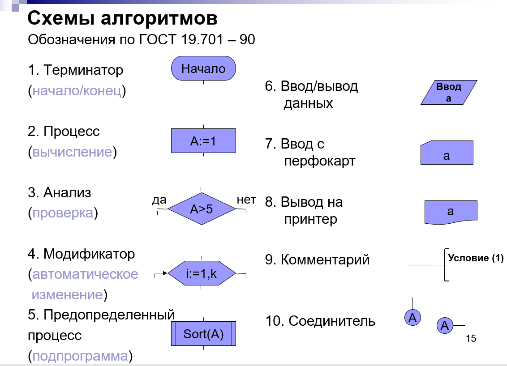
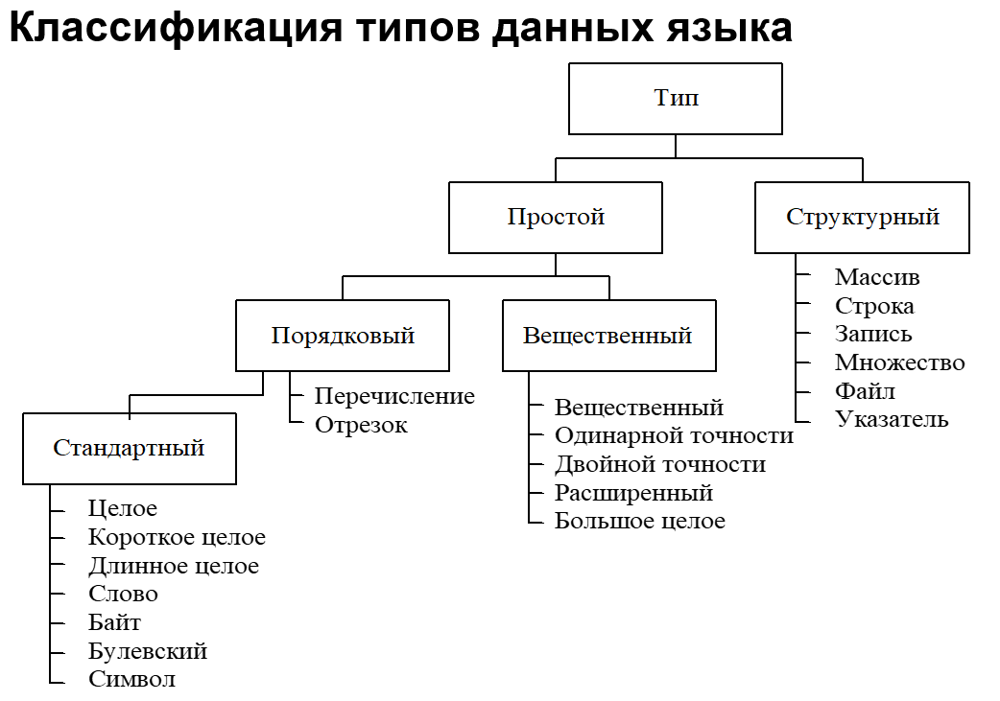
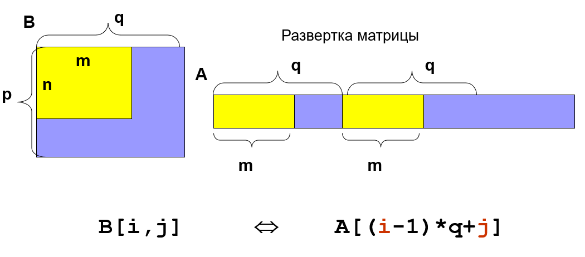
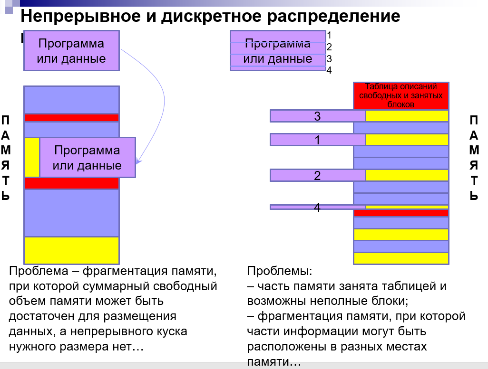
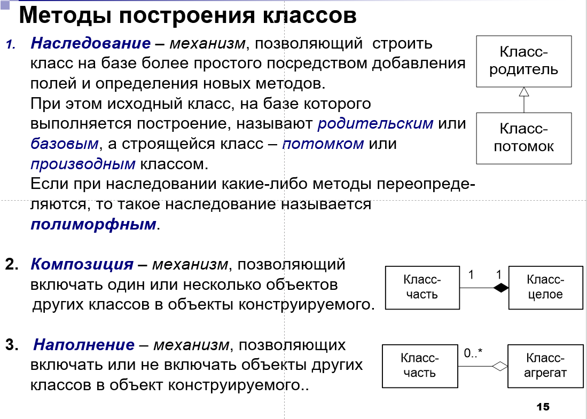

# Вопросы к экзамену и ответы на них

## 1. Синтаксис и семантика языков программирования. Алфавит языка Pascal. Описание синтаксиса языка: синтаксические диаграммы. Примеры

### Синтаксис и семантика

Синтаксис: "Как пишется"
Семантика: "Что значит"

> Синтаксис - правила, определяющие допустимые конструкции языка. «Защищенный» синтаксис предполагает, что предложения языка строятся по правилам, которые позволяют автоматически выявлять большой процент ошибок в программах.  
> Семантика – правила, определяющие смысл синтаксически корректных предложений. Ясная или «интуитивно-понятная» семантика – семантика, позволяющая без большого труда определять смысл программы или «читать» ее.

### Общая идея

Все программы содержат раздел описаний и раздел операторов. В блоке описаний можно объявлять переменные (иногда инициализировать), собственные типы, прототипы функций/процедур. В блоке операторов содержатся операторы (как неожиданно), операторы разделяются `;` (в отличие от си-подобных языков, где `;` означает конец выражения). Программа разделяется на основную программу (точка входа) и подпрограммы (процедуры/функции).

### Алфавит

- латинские буквы без различия регистра
- арабские цифры
- шестнадцатеричные цифры: 0..9, a..f
- специальные символы: `+ - * / = := ;` и т.д.
- служебные слова: `while, for, do, begin, end` и т.д.

## Синтаксические диаграммы



## 2. Представление данных в языке Pascal: константы и переменные. Классификация скалярных типов данных, их внутреннее представление, операции над ними. Примеры

> Константы - неизменяемые данные.  
> Литералы - константы, указанные непоследственно в программе (`-25, $2a, true, 'd', #65, 'foo', nil`)

```pascal
//константа
const {name} = {value};

// переменная
var {name}: {type};
```



Целые:

- integer (longint) 4 байта
- smallint 2 байта
- shortint 1 байт
- word 2 байта без знака
- byte догадайтесь сами

Вещественные:

- real/double 8 байт
- single 4 байт
- extended 10 байт
- comp 8 байт

Устройство вещественных чисел: знаковый бит + порядок (характеристика) + мантисса

Также есть:

- boolean 1 байт (связано с тем, что минимальное адресуемая единица - 1 байт)
- widechar 2 байта (таблица unicode)
- Перечисление. Описываются всевозможные варианты значения

```pascal
type whoami = (Cat, Human, Clock);
var he: (Cat, Human, Clock)/whoami;
he := Human;
```

- Отрезки

```pascal
type months = 1..12;
```

### Доступные операции

`:=, +, -, / (вещественно), div (целочисленно), mod, <, <=, <>, =, and, or, xor, not, shr, shl`

```pascal
Ord - предыдущее значение
Pred - значение, уменьшеное на 1 (для целочисленных эти функции эквиваленты)
Succ - следующее значение
Inc - значение, увеличенное на 1
High - самое большое значение типа
Low - самое малое значение типа
```

## 3. Совместимость типов данных и операции преобразования типов. Примеры

При операциях приисходит неявное приведение типов по следующей схеме:

- При арифметике целого и вещственного - оба преобразуются к вещественную
- При арифметике с разными интервалами представлений - к большему интервалу.
- При сравнении вещественных типов рекомендуется указывать допуск:

```pascal
abs(x-y) < eps
```

В случае переполнения при арифметической операции происходит переход в начало интервала типа. Или при включённом флаге происходит паника.

Для явного преобразования существуют функции

```pascal
trunc(real): integer // отрезает дробную часть
round(real): integer // округляет по правилам арифметики
ord(type): integer // возвращает номер значения в типе
chr(integer): char // возвращает символ с номером
```

## 4. Присваивание, условный оператор, оператор выбора. Синтаксис операторов, их особенности и примеры использования.

Представление в паскале:

```pascal
// Оператор присваивания
foo := bar;

// Условный оператор
if {exp} then
{code}
else if {exp} then
{code}
else
{code}

// Оператор выбора
case {exp} of
  {exp}: {code};
  {exp}: {code};
  else {code};
end;

case 1+2*j of
  3:  Write('1');
  -1..1, 10: Write('2');
  else: Write('3');
end;
```

### Особенности

Ветвь `else` относится к ближайшему `if`

## 5. Операторы циклов языка Pascal. Синтаксис операторов, их особенности и примеры использования

Типы циклов:

- Счётные - `for` (известно кол-во повторений)
- Итерационные - `while, repeat until` (пока выполняется какое-то условие)
- Поисковые (нашли или перебрали всё и не нашли)

Представление в паскале:

```pascal
while {exp} do
  {code}

repeat
  {code}
until {exp} // пока выражение ложно

for {var} := {start} to/downto {end} do
  {code}
```

## 6. Поисковый цикл. Неструктурная и структурная реализации поискового цикла

Структурная реализация отличается от неструктурной тем, что использует только структурные операторы (`break` таковым не является). Для структурной реализации используют флаг, который сигнализирует о наличии требуемого элемента.

```pascal
// Структурный
found := false;
i := 0;
while (i < High(arr)) and (not found) do begin
  if arr[i] > 5 then begin
    write(arr[i]);
    found := true;
  end;
  i += 1;
end;

// Неструктурный
i := 1;
while i < High(arr) do begin
  if arr[i] > 5 then begin
    write(arr[i]);
    break; // плохо
  end;
  i += 1;
end;
```

## 7. Массивы языка Pascal. Описание, внутреннее представление, операции над массивами и их элементами. Примеры

> Упорядоченная совокупность однотипных данных. каждому элементу массива соответствует один или несколько индексов порядкового типа, определяющих положение элемента в массиве.

Кол-во типов индексов опеределяет **размерность массива**.
Пример: двумерный массив, одномерных массив и т.д.

- Тип индекса - порядковый - определяет доступ к элементу
- Тип элемента - любой кроме файла.

Массив в памяти не может занимать больше 2гб. Интересно, что в книге Иванова не даёт каких-либо комментариев по этому поводу)0). По её словам, это связано с тем, что в 32-х разрядных системах (где максимум 4 гб памяти), половина выделяется под операционную систему, соответственно оставшаяся часть уже может быть использована прикладной программой.  
_Если честно, меня такое объяснение ни разу не удовлетворяет и вообще создаёт ощущение кривости формулировки. Проще принять это как особенность паскаля, а не задумываться о разрядности. + даже к такому ответу есть много претензий._

```pascal
type foo = array[ord_type] of type;

type bar = array[1..64] of integer;
var baz: bar;
```

Внутренне массив представляется как упорядоченная последовательность ячеек. Каждая ячейка имеет свой индекс, по которому к ней можно обратиться.

Операции над массивами:

```pascal
// Чтение из ячейки
// Прямой доступ
bar := arr[5]
// Косвенный доступ (от переменной, а не литерала)
bar := arr[foo]

// Запись в ячейку
arr[foo] := bar;
```

Также возможно, что Иванова под операциями над массивами подразумевает последовательную обработку его элементов с какой-то целью, например, для вывода на экран.

## 8. Строки языка Pascal. Описание, внутреннее представление, операции над строками и их элементами. Примеры

> Строка - последоватльность символов.

```pascal
foo: string[{max_length}]
bar: string[{max_length}] = '{value}';
```

Внутреннее представляется как массив байтов, где в первом элементе хранится текущая длина строки (<= максимальной), а в последуюших сами символы строки.

**Максимальная длина строки - 255**, т.к. первый байт, отвечающий за длину, может принимать значения от 0 до 255.

**При переполнении никакой ошибки не выдаётся.**

Операции над строками:

```pascal
foo, bar: string[40]

foo := bar // Присваивание
foo := '';

foo := foo + bar // Конкантенация

foo > bar // Попарное сравнение соответствующих элементов, результат определяется первым неравным сравнением.

// Без комментариев
Length(foo): integer
Delete(foo, index, count)
Insert(foo, bar. count)
Copy(foo, index, count): string

Pos(foo, bar): integer // индекс первого вхождения строки bar в foo. Если вхождений нет, то 0.
UpCase(char): char // Соответствующий символ верхнего регистра.
Str({integer}[:w[:d]], foo) // из числа в строку (передаётся ссылкой)
Val(foo, integer, code) // из строки в число. При успешном переводе code имеет значение 0, в противном случае - другое.
```

## 9. Множества языка Pascal. Описание, внутреннее представление, операции над множествами и их элементами. Примеры

> Множество - неупорядоченная сокупность неповторяющихся данных.
**Максимальная длина - 256** (TODO: Спросить почему)

```pascal
type s1 = set of char
type s2 = set of 1..100;
```

```pascal
// Конструкторы для множества
[] // пустое множество
[2, 3, 5, 6, 11] // множество чисел
['a', 'b', 'e', 't'] // множество символом
[1, k] // множество чисел 1 и k
[2..100] // множество значений от 2 до 100
[k..2*k] // можно задать выражением
[red, yellow, green] // множество перечисляемого типа
```

```pascal
// Операции над множествами
a = []
b = []
a + b // объединение
a * b // пересечение
a - b // дополнение множества b до a (или a до b, у Ивановой так написано. Хотя я сам думаю, что правилен первый вариант)
a = b
a <> b
a <= b // нестрогое вхождение a в b
a > b // сторогое
```

В памяти множество представляется как последовательность ячеек, хрянящих булево значение. Каждая ячейка хранит наличие или отсутствие элемента в множестве.

## 10. Записи языка Pascal. Описание, внутреннее представление, операции над записями и их элементами. Примеры

> Структура данных, образованная _фиксированным_ числом разнотипных компонентов. Элементы внутри записи называются полями.

```pascal
type employee = record
  id: integer;
  name: string;
  last_name: string;
  phone: string[11];
end;

var petr: employee;

petr.name := 'petr'; // точечная нотация
with petr do last_name := 'vasilyev'; // через оператор доступа
```

Можно объявлять с использованием типизированных констант:

```pascal
var petr: employee = (id: 0; name: 'petr'; last_name: 'vasilyev'); // Компилятор разрешает инициализировать не все поля (мда, очень "безопасный синтаксис")
```

В памяти представляется как блок памяти, где последовательно хранятся значения каждого поля записи. (Адрес поля можно получить, прибавив к адресу начала записи размер полей, идущих до требуемого поля.)

## 11. Процедуры и функции. Определение, описание, особенности. Примеры

> Самостоятельные фрагменты программы, вызываемые по имени.

Можно попробовать дать определение по признакам.  
Функция/процедура:

- Имеет имя
- Имеет >= 0 параметров
- Исполняет код, зависящий от параметров
- Может возвращать результат (в случае функции)

_Предполагается, что функции/процедуры не используют глобальную память и используют свои агрументы по назначению._

```pascal
// Синтаксис объявления процедур
procedure foo(a: integer);

// Синтакис объявления функций
function bar(b: integer): real;
// Скобки можно опускать, если нет параметров
function baz: real;
```

**Процедуры в отличие от функций не могут возвращать значения.**

## 12. Способы передачи данных в подпрограмму на языке Pascal. Примеры

Есть два ~~стула~~ способа:

- Через глобальные переменные (неявно)
- Через параметры (явно)

**Строго рекомендуется использовать только второй способ, т.к. первый жестко связывает подпрограмму и данные и приводит к большому количеству ошибок (самостоятельно ответьте на вопрос `почему так происходит`).**

Здесь ещё можно привести пример, демонстрирующих оба способа передачи, достоинства и их недостатки и т.д., но мне лень : /

## 13. Локальные и глобальные переменные, законы «видимости» идентификаторов. Примеры

Глобальные и локальные переменные отличаются в нескольких отношениях:
| Признак | Глобальные | Локальные |
|---------|------------|-----------|
|Где объявляются|В основной программе|В подпрограммах|
|Время жизни|От старта работы до завершения - всё время работы программы|От вызова подпрограммы до возврата управления - время работы подпрограммы|
|Доступность|Из любого места, включая подпрограммы*|Из подпрограммы и подпрограмм, вызываемых из неё*|

\*при отсуствии перекрытия имён

- Если имя локальной переменной совпадает с именем глобальной, то локальная переменная "перекрывает" глобальную, которая в свою очередь становится недоступна.

## Формальные и фактические параметры подпрограмм языка Pascal. Примеры

- Формальные - те, которые пишутся в заголовке функций/процедур.
- Фактические - те, которые передаются в подпрограмму непосредственно при вызове.

Параметры можно передавать по значению и по ссылке. В случае передачи по значению, значение переменной копируются. При передачи по ссылке работа идёт с переменными из вызывающей программы, соответственно все изменения переменных также отражаются в вызывающей программе.

При передаче по _изменяемой_ ссылке нельзя передавать литералы.

При передаче по неизменяемой ссылке параметр всё равно ссылается на переменную из вызывающей программы, но вызываемая программа не может её менять.

```pascal
// По значению
procedure foo(bar: integer);

// По изменяемой ссылке
procedure foo(var bar: integer);

// По неизменяемой ссылке
procedure foo(const bar: integer);
```

## 15. Параметры-строки, параметры-массивы. Примеры

При передаче структурных параметров (массивы, множества, строки, записи, указатели, файлы) их типы должны быть объявлены заранее.

```pascal
function foo(bar: ^integer): ^integer; // ошибка

type int_ptr = ^integer;
function foo(bar: int_ptr): int_ptr; // правильно
```

_Хотя компилятор будет ругаться только на тип возвращаемого значения..._

## 16. Принципы разработки универсальных подпрограмм: «открытые» массивы. Примеры

Конструкция объявления массива без указания типа индекса. **Используется при объявлении формальных параметров.** Наряду с стандартным использованием открытые массивы также можно использовать для объявления динамических массивов, память под которые выделяется во время выполнения процедуры `SetLength`.

**Индексы открытых массивов всегда начинаются с нуля.**
Также к открытым массивам применимы функции `High` и `Low`, которые возвращают индексы последнего и первого элементов соответственно.

Используются для повышения универсальности подпрограмм, которые непривязаны к длине передаваемых массивов.

```pascal
function foo(bar: array of integer): integer;
```

## 17. Принципы разработки универсальных подпрограмм: нетипизированные параметры, параметры процедурного типа. Примеры

### Нетепизированные параметры - ссылочные параметры без типа

```pascal
procedure foo(var bar);
```

Для работы с такими параметрами необходимо привести их определённому виду. Есть несколько способов:

```pascal
// Автоопределённое преобразование типов
procedure foo(var bar);
...
  b := Integer(bar) + 10;
...

// Наложенное описание переменной определённого типа
procedure foo(var bar);
var baz: integer absolute bar;
```

Фактически на область памяти, на которую ссылается нетипизированный параметр, накладывается разрядная сетка типа, к которому приводят параметр, надеясь, что получится нечто вразумительное.

Такую особенность можно использовать для написания некоторых вещей:

- Универсальные подпрограммы над разными типами
- Универсальные подпрограммы над многомерными массивами.

Подпрограммы, работающие с многомерными массивами, используют тот факт, что строки, столбцы и другие направления в них располагаются сторого упорядоченно в одну полоску данных. Для двумерного массива: строки идут попорядку друг за другом:



### Параметры процедурного типа

Всё очень просто, функции/процедуры в паскале являются [объектами первого класса](https://ru.wikipedia.org/wiki/%D0%9E%D0%B1%D1%8A%D0%B5%D0%BA%D1%82_%D0%BF%D0%B5%D1%80%D0%B2%D0%BE%D0%B3%D0%BE_%D0%BA%D0%BB%D0%B0%D1%81%D1%81%D0%B0). Соотвественно для их использования в качестве объектов первого класса нужно сделать следующее:

1. В файле написать флаг компиляции для free pascal (переключить его в режим Delphi), т.к. без него он не умеет в передачу процедурных типов.

2. Объявить процедурный тип:

```pascal
type func = function(bar: integer): integer;
```

3. Использовать его:

```pascal
procedure foo(baz: func);
```

## 18. Структура модуля языка Pascal. Законы видимости идентификаторов. Доступ к «перекрытым» идентификаторам. Примеры

> Модуль - автономно компилируемая коллекция программных ресурсов, предназначенных для использования другими модулями.

> Ресурсы - переменные, константы, описания типов и подпрограммы.

1. Внешние - предназначены для использования другими программами и модулями
2. Внутренние - предназначены для использования внутри модуля

```pascal
// Структура модуля
unit {name};
interface
{секция объявлений}
implementation
{секция реализация}
initialization
{секция инициализаций}
finalization
{секция завершения}
end.
```

```pascal
// Подключение модулей
uses foo in '../foo.pas'; // Можно указать относительный или абсолютный путь или неуказывать, если модуль находится в корневой папке проекта.
```

Использование указания `in …` в файлах с расширением pas не допустимо, т.к. модули объявление в файле проекта считаются частью проекта, т.е. в других модулях можно просто указывать название модуля без `in`. 

**Ресурсы модуля перекрываются ресурсами программы и ранее указанных модулей.**

Для доступа к перекрытым идентификаторам можно использовать оператор `.`

```pascal
uses foo in '../foo.pas';

procedure bar;

foo.bar() // можно обратиться к перекрытому ресурсу
```

## 19. Рекурсия. Виды рекурсии. Особенности программирования. Достоинства и недостатки. Пример

> Организация вычислений, при которой процедура или функция вызывает саму себя.

- Явная рекурсия - функция вызывает сама себя
- Косвенная рекурсия - функция вызывает другую функцию, которая вызывает исходную.

Для косвенной рекурсии нужно использовать слово `forward`.

```pascal
procedure foo; forward;

procedure bar;
begin
  foo
end;

procedure foo;
begin
  bar
end;
```

Базис функции - случай, когда функция перестаёт рекурсивно себя вызывать:

```pascal
function fac(n: integer): integer
begin
  if n > 1 then
    Result := n * fac(n-1)
  else
    Result := n // базис рекурсии
end;
```

При каждом вызове функции на стек добавляется её фрейм активации, который включает:

- локальные переменные
- копии параметров-значений
- адреса параметров-переменных и параметров-констант (4 байта)
- копию строки результата (для функция типа `string`)
- служебную информацию (~12 байт)

При этом, по словам Ивановой, компилятор паскаля _не умеет_ оптимизировать хвостовую рекурсию, из-за чего любой рекурсивный алгоритм имеет оверхед по потребляемой памяти, по сравнению с циклическими аналогами.

Также различают линейную и древовидную рекурсию. При древовидной рекурсии функция вызывает саму себя несколько раз, когда при линейной - один. В качестве примера можно рассмотреть алгоритм вычисления всех возможных перестановок.

Достоинства:

- Древовидная рекурсия позволяет писать алгоритмы, которые при циклах были бы очень сложны
- Мне лично удобно писать обработчики рекурсивных структур данных с помощью рекурсии. Будь то связный список или дерево.

Недостатки:

- Оверхед по потреблению памяти из-за стоимости каждого вызова и отсутствию оптимизации хвостовой рекурсии.
- ~~зумеры слишком тупые, чтобы освоить рекурсию~~ Трудность отладки и в целом построения рекурсивных алгоритмов.

## 20. Адресация динамической памяти: понятие адреса, операции получения адреса и разыменования. Процедуры получения памяти и освобождения ее. Примеры

Память компьютера состоит из упорядоченного набора минимальных адресуемых единиц (чаще всего это байты). Байты нумеруют, начиная с 0. _Вопрос на засыпку, на определение чего похоже первое предложение?_

Для удобства абсолютный адрес данных разделяют на базу и смещение. База - какой-то общий адрес, смещение - сдвиг вперёд относительно базы.

Адресация по схеме "базис + смещение" обеспечивает "перемещаемость" программ в оперативной памяти, т.е. загрузку в разные места оперативной памяти в зависимости от того, какой участок свободен.

Указатель - 4 байта без знака, которые используют для хранения смещений, может адресовать сегмент размером 2^^32 = 4гб.

Оператор `@` или функция `Addr` возвращают указатель на переменную в памяти.
Оператор `^` используется для разыменовывания указателя (помимо объявления типизированных указателей)

```pascal
bar := 5;
foo := @bar; // foo:  ^integer
baz := foo^; // baz = 5;
```

Процедуры `New({^type})` и `Dispose({^type})` позволяют выделить (количество определяется в соответствии с типом указателя) и освободить память, на которую указывает указатель.

Также существуют процедуры `GetMem({pointer}, {size})` и `FreeMem({pointer}[, {size}])`, которые позволяют выделять память на нетипизированные указатели с явным количеством байт.

**Разыменовывать нетипизированный указатель нельзя. Для разыменовывания его нужно привести к какому-то типу.**

Просто оставлю это здесь:



## 21. Списковые структуры данных. Классификация и основные приемы работы с ними: создание элемента, добавление элемента к списку, удаление элемента из списка. Область применения списковых структур данных. Пример

Примеры линейных и динамических структур:

- Стек (реализует парадигму LIFO - last in, first out)
- Очередь (реализует парадигму FIFO - first in, first out)
- Дек (~~считайте его панком.~~ Умеет добавлять и удалять элементы с любой стороны)

Такие структуры можно организовать с помощью списков, которые бывают:

- линейные
- кольцевые
- древовидные
- N-связные

Интерес представляют связные списки. Они подобны массивам, но могут иметь произвольное количество элементов, могут добавлять и удалять элементы, не перемещая остальных. Ради таких удобств проходится платить: нет прямого обращения по индексу, требуют больше памяти.

Различают односвязаные, двусвязные и n-связные списки. Односвязные - элемент ссылается на следующий после себя, двусвязные - элемент ссылается на следующий и предыдущий, n-связные - элемент ссылается на n-других элементов.

Добавлять элементы в список можно по стеку или по очереди. (см 6 презентацию)

## 22. Основы файловой системы: файл, каталог, полное имя файла, внутреннее представление информации в файле. Файловая переменная. Операции открытия и закрытия файлов. Примеры

> Файл - поименованная последовательность элементов данных (компонентов файла), хранящихся, как правило, во внешней памяти.

Как исключение данные файла могут не храниться, а вводиться с внешних устройств (ВУ), например клавиатуры или выводиться на ВУ, например экран.

Алфавит названия файла:

- буквы латинского и русского алфавита
- арабские цифры
- некоторые специальные символы (например, `_` и `$`)

Винда: корень - логический диск  
Линух: корень - корневой каталог (не имеет имени)

Наиболее общепринятой является древовидная структура фс.

Путём файла называется перечень каталогов, который необходимо пройти от начального, чтобы добраться до файла (`/dir1/dir2/file`).

Полное имя файла или абсолютный путь - путь до файла от корневого каталога.
Относительное имя файла или относительный путь - путь до файла от отличной от корневого каталога папки.

Файл в паскале - последовательность однотипных компонентов.
Фактически, тип `файл` - некоторая таблица (`record`) с данными о внешнем файле.

Существует несколько файловых типов: **типизированные, нетипизированные, текстовые.**

Физически использование файлов выполняется с помощью буфера.

К файлам разрешён произвольный доступ, при котором чтение информации осуществляется из указанного места.

Доступ к компонентам файла осуществляется через указатель файла. При выполнении чтения или записи указатель автоматически перемещается на следующий компонент, пока не дойдет до маркера конца файла (символ eof (end of file), `#26`). При попытке чтения после конца файла возникает ошибка.

**В подпрограммах файловые переменные можно использовать только по ссылке.** Полагаю, это связано с особенностью файловых типов. Операция присваивания для файловых переменных не является тривиальной и в зависимости от состояния переменной может приводить к разным результатам. _Лучше данную гипотезу перепроверить._

Для работы с файловой переменной нужно сделать несколько вещей:

1. Инициализировать с помощью процедуры `Assign(var f; path: string)`.
2. Открыть файл c помощью процедур в зависимости от цели на чтение `Reset(var f)`, запись `Rewrite(var f)` (причём указатель будет установлен на начало файла и ранее записаные данные будут стираться) или добавление `Append(var f)` (указатель будет установлен после последнего компонента).
3. Провести некоторую работу с файлом.
4. Закрыть файл с помощью `Close(var f)`. При этом процедура обеспечивает вывод оставшихся компонентов из буфера в файл. Важно заметить, что связь файловой переменной с файлом сохраняется, поэтому при продолжении обработки вызывать `Assign` не нужно.

Для проверки корректности операция ввода/вывода существует функция `IOResult: Word`, которая возвращает код завершения операции ввода/вывода. 0 - операция прошла нормально, в ином случае возвращается код ошибки. Функцию можно применять при отключенном контроле операций ввода/вывода `{$I+/-}`:

```pascal
Var  f:file of char;
Begin 
  AssignFile(f,’a.dat’);  {инициализация ф. п.}
{$I-}     {отключение контроля ошибок ввода-вывода}
  ReSet(f); {открытие файла для чтения}
{$I+} {включение контроля ошибок ввода-вывода}
  if IOResult<>0 then WriteLn('File was not found') 
  else   WriteLn('File was found'); ...
```

Наконец стандартные функции и процедуры для работы с файлами:

```pascal
Rename(var f; name: string)
Erase(var f) // Перед удалением файл должен быть закрыт
EOF(var f): boolean; // Стоит ли указатель на маркере конца файла или нет
```

## 23. Текстовые файлы. Внутреннее представление информации в файле. Операции над файлами. Пример

> Типизированный файл, у которого компоненты - символьные строки переменной длины.

Внутри файл строки разделяются маркером конца строки `#13` (`\r`) и `#10` (`\n`). Стоит сказать, что устройство маркера конца строки зависит от операционной системы: у windows это `\r\n`, у linux `\n`. Данное различие лежит на уровне файловой системы.

Собственно, внутренне файл представляется как последовательность байт, где каждый байт кодирует 1 символ (или каждые 2, в зависимости от кодировки), строки разделены байтами, имеющими номерам маркеров конца строки. В конце файла записан байт с значением маркера конца файла.

```pascal
var f: Text; // Пример объявления
```

Существуют стандартные текстовые файлы, связанные с логическими устройствами ввода/вывода. Эти уже определены и доступны по умолчанию. Обращение к ним происходит в случае, если при вызове подпрограммы работы с текстовыми файлали не указать конкретный файл.

Процедуры и функции для работы с текстовыми файлами:

```pascal
EOLn ([var f]): boolean // Возвращает `true` если указатель стоит на маркере конца строки. При работы с стандартным вводом возвращает `true`, если последний считанный символ был маркером конца строки. При работы с диском - если следующий символ будет маркером конца строки.
SeekEOLn([var f]): boolean // Пропускает пробелы и знаки табуляции до первого значащего символа или маркера конца строки. Возвращает `true` при обнаружении маркера.
SeekEOF([var f]): boolean // Пропускает пробелы, знаки табуляции, _маркеры конца строки_ до первого значащего символа или маркера конца файла. Возвращает `true` при обнаружении маркера.
Read([var f;] v1, v2, ..., vn) // Без комментариев
ReadLn([var f;] v1, v2, ..., vn) 
Write([var f;] v1, v2, ..., vn)
WriteLn([var f;] v1, v2, ..., vn)
```

## 24. Типизированные файлы: внутреннее представление информации в файле. Операции над файлами. Пример

> Файл, содержащий компоненты определённого типа.

Внутренне файл представляется как последовательность байт, где друг за другом без разделителя записаны компоненты. Компоненты в файле имеют то же представление, что и переменные того же типа в памяти.

Поскольку размер компонентов **одинаков и известен** возможен не только последовательный, но и **прямой** доступ.

```pascal
var f: file of integer; // Пример объявления
```

Процедуры и функции:

```pascal
Read, Write // аналогично текстовым файлам
Seek(var f; numcomp: integer) // Устанавливает указатель на компонент с номером `numcomp`. Нумерация начинается с 0.
FileSize(var f): integer // Возвращает кол-во компонентов файла
// Интересная комбинация. Устанавливает указатель на конец файла
Seek(f, FileSize(f)) 
FilePos(var f): integer // Возвращает порядковый номер компонента, который будет обработан следующим.
Truncate(var f) // Выполняет усечение файла. Ставит маркер конца файла на текущем компоненте, тем самым обрубая всё после.
```

_Интересно, что в презентации Ивановой функции в последнем блоке возращают longint, что по сути integer (тип один и тот же, просто несколько алиасов), то есть возвращаемое значение имеет размер в 4 байта. Однако лазарус подсказывает, что эти функции возвращают тип int64, что является 8-ми байтным числом. Несостыковка._

## 25. Нетипизированные файлы. Внутреннее представление информации в файле. Операции над файлами. Пример

> Файлы, объявленые без указания конкретного типа компонентов.

Операции чтения и записи для таких файлов осуществляется блоками, что позволяет организовать высокоскоростной обмен между диском и памятью. Такая особенность делает их совместимыми с любыми другими файлами, но усложняет обработку.

Нетипизированные файлы также допускают прямой доступ, но к блокам.

```pascal
Reset(var f[; recsize: word]);
Rewrite(var f[; recsize: word]);
```

Параметр `recsize` определяет размер блоков (в байтах), которыми будет читаться файл. Длину задают кратной 512 байт, например 1024, 2048. Если длина записи не указана, она становится равной 128.

```pascal
BlockRead(var f; var buf; count: word[; var res: word]) // Чтение из файла в буфер
BlockWrite(var f; var buf; count: word[; var res: word]) // Запись из буфера в файл
```

Параметр `count` определяет количество блоков, которое будет записано в `buf`.  
Параметр `res` будет содержать количество фактически обработанных записей. Если последняя запись неполная, то значение `res` её не учтёт.

- Halt([exitcode: word]) - осуществляет вполнение всех процедур выхода.

Также дополнительные процедуры и функции для работы с файлами:

```pascal
Function ChangeFileExt(const FileName, 
                       Extension: string): string // Изменяет существующее расширение файла на указанное. 
Procedure ChDir(const S:string); overload;
Procedure ChDir(P:PChar); overload; // Изменяет текущий каталог (каталог по умолчанию).
Function CreateDir(const Dir: string): Boolean // Создает новый каталог.
Function DeleteFile(const FileName: string): Boolean // Удаляет указанный файл.
Function DirectoryExists(const Directory: string): Boolean // Проверяет существование каталога по указанному адресу.
Function DiskFree(Drive: Byte): Int64 // Возвращает объем в байтах свободного пространства на указанном диске:
// 0 – устройства по умолчанию; 1 – диск А; 2 – диск В и т.д. Функция возвращает -1, если указанный диск не существует. 
Function DiskSize(Drive: Byte): Int64 // возвращает объем памяти указанного диска.
Function FileExists(const FileName: string): Boolean // проверяет существование файла по указанному адресу;
Function FileSearch(const Name, DirList: string): string // ищет файл в указанных через точку с запятой каталогах, если не находит, то возвращает пустую строку.
Function FindFirst(const Path: string; Attr: Integer; var F: TSearchRec): Integer // ищет в каталоге первый файл с указанной маской и атрибутами;
Function FindNext(var F: TSearchRec): Integer // ищет следующие файлы.
Function GetCurrentDir: string // возвращает имя текущего каталога.
Function ForceDirectories(Dir: string): Boolean // создает каталоги и подкаталоги.
Function RemoveDir(const Dir: string): Boolean // удаляет указанный пустой каталог.
Function SetCurrentDir(const Dir: string): Boolean // устанавливает текущий каталог.
```

## 26. Классы консольного режима среды Lazarus: описание классов, поля и методы, объявление объектов класса, доступ к полям и методам объекта, ограничение доступа. Пример

> С точки зрения синтаксиса класс - структурный тип данных, в котором помимо полей разрешается объявлять прототипы методов (процедур и функций, работающих с этими полями).

```pascal
// Объявление класса
type rect = object
              a: integer;
              function square: integer;

// Имплементация функции
function rect.square: integer;
begin
  Result := a * a;
end;

var foo: rect; // экземпляр класса `rect`
```

Доступ к полям и методам осуществляется с помощью оператора точка `.` (точечная нотация) или через оператор доступа `with`

```pascal
foo.a := 2;
with foo do begin
  a := 2; // и так, и так можно. Открытым остаётся вопрос о надобности такой длинной нотации.
end;

WriteLn(foo.square);
```

Для ограничения доступа к полям можно воспользоваться специальными секциями:

- `private` - поля и методы доступны _внутри модуля_, где объявлен класс.
- `public` - поля и методы доступны всем подряд.

_Если секция не указана явно, то поле/метод, находящиеся в ней, считаются доступными всем (то есть как будто они объявлены в секции `public`)._

```pascal
type cube = object
              private
                side: integer;
              public
                function volume: integer;
                procedure init(a: integer);
                function get_side: integer;
            end;
```

Примечание: вообще говоря, в паскале также есть ключевое слово `protected`, но о нём Иванова не упоминала, а потому будет логичным забыть об этом в рамках подготовки к экзамену.

## 27. Классы консольного режима среды Lazarus: Способы инициализация полей. Неявный параметр Self. Пример

Рассматривается 3 способа инициализации полей экземпляров:

1. прямым занесением данных в поле
2. с использованием типизированных констант
3. посредством специального метода.

### Прямое занесение данных в поле

_Возможно только при доступности поля (если только класс не объявлен стороннем модуле и поле не объявлено в секции `private`)._

```pascal
var c: cube;
begin
  c.side := 3;
end;
```

### Использование типизированных костант

При этом доступность поля игнорируется...

```pascal
var c: cube = (side: 3);
```

### Специальный метод

Идея заключается в том, чтобы создать процедуру, параметры которой будут инициализировать объект.

```pascal
var c: cube;
begin
  c.init(4);
end;
```

Любой метод имеет неявный параметр `self`, это ссылка (не указатель!) на объект, для которого вызывается метод. Следующая форма получения полей тоже валидна:

```pascal
function cube.init(a: integer);
begin
  self.side := a;
end;
```

## 28. Процедурная и объектная декомпозиция. Диаграммы классов. Отношения между классами. Примеры

_Звание самого душного билета получает..._

> Объектная декомпозиция – процесс представления предметной области задачи в виде отдельных функциональных элементов (объектов предметной области), обменивающихся в процессе выполнения программы входными воздействиями (сообщениями) .
Объект отвечает за выполнение некоторых действий, инициируемых сообщениями и зависящих от параметров объекта.

Определение процедурной декомпозиции я не нашёл ни в учебнике, ни в презентациях...

> На мой взгляд, процедурная декомпозция - представление _процессов_ предметной области задачи в виде отдельных функциональных элементов (подпрограмм), вызывающих друг друга во время работы программы. Подпрограммы отвечают за вополнение некоторых действий, инициируемых вызовами с соответствующими параметрами.

Объект предметной области характеризуется:
 именем;
 состоянием;
 поведением.
Состояние – совокупность значений характеристик объекта, существенных с т. з. решаемой задачи.
Поведение – совокупность реакций на сообщения.

> Класс – это структурный тип данных, который включает описание полей данных (переменный класса, хранящих состояние и его атрибуты), а также процедур и функций, работающих с этими полями данных. Применительно к классам такие процедуры и функции называются _методами_.

Основные принципы, на которых базируется объектно-ориентированное программирования.

- Абстрагирование – выделение абстракций в предметной области задачи; под абстракцией при этом понимается совокупность существенных характеристик некоторого объекта предметной области, которые отличают его от всех других видов объектов;
- Инкапсуляция – размещение в одном программном компоненте (объекте) данных и подпрограмм, которые с этими данными работают;
- Ограничение доступа – сокрытие отдельных элементов реализации абстракции, не затрагивающих существенных характеристик ее как целого;
- Модульность – принцип разработки программной системы, предполагающий реализацию ее в виде отдельных частей;
- Иерархичность – использование иерархий при разработке программных систем; при этом используются как иерархии "целое-часть", так и иерархии "общее-частное";
- Типизация – ограничение, накладываемое на свойства объектов и препятствующее взаимозаменяемости абстракций различных типов (или сильно сужающее возможность такой замены).

Различают 3 вида отношений между классами:



Чем принципиально отличаются композиция и наполнение? При наполнении класс может включать неопределённое количество (от 0 до заранее неизвестных значений) объектов других классов (при композиции их фиксированное количество).

Примеры от Ивановой (так себе объяснение, но условно разница ощущается):  

- пример композиции: квартира. В ней может быть от 1 до 15 комнат (знаем заранее)  
- пример наполнения: комната с балконом. Либо в ней есть балкон, либо нет.

_Если на диаграмме только наследование, то диаграмма называется иерархической._

## 29. Динамические объекты и объекты с динамическими полями в консольном режиме среды Lazarus. Примеры

## 30. Технология событийного программирования. События операционной системы, сообщения и события Lazarus. Основные события Lazarus. Примеры
